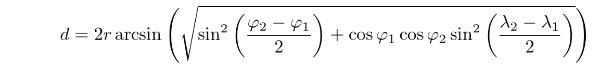

# Homework 3

## Problem 1

Memoization is an optimization technique for speeding up function calls by caching the function result for a given set of inputs.

The standard library provides a decorator `functools.lru_cache` that performs memoization of any function it wraps.
It only stores results from the N most recent calls.  This is called a least recently used (LRU) cache.

For this problem, you will write your own version of `@lru_cache`.

`lru_cache(max_size=128)` should be a decorator that does the following:

- Return the wrapped function with its arbitrary arguments.
- Maintain an LRU cache that stores up to `max_size` arguments and their corresponding results.
    - Function arguments of different types must be cached separately.  For example `f(3)` and `f(3.0)` are distinct calls.
    - The cache must use a LRU policy, a good illustration of this is at
      https://en.wikipedia.org/wiki/Cache_replacement_policies#Least_recently_used_(LRU)
    - Add a `cache_info` property to the returned wrapped function object, of type `CacheInfo` below.


### `CacheInfo`

You must also define a new class named `CacheInfo`. It should have the following **public** attributes:

- `hits`: Number of calls to the function where the result was returned from the cache.
- `misses`: Number of calls to the function where the result needed to be calculated by calling the function.
- `max_size`: The maximum number of entries the cache can store.
- `cur_size`: The number of entries currently stored.

The class must also provide its own string representation that looks like this:

```python
>>> from problem1 import CacheInfo
>>> cache_info = CacheInfo(max_size=4)
>>> print(cache_info)
CacheInfo(hits=0, misses=0, max_size=4, cur_size=0)
```

These are the only requirements for `CacheInfo`, but you may find it helpful to add other methods/properties to the class to support your implementation.

### Example
```python

@lru_cache(5)
def add(a, b):
    print(f"add({a}, {b})")
    return a + b

add(1, 2)  # will print add(1, 2)
add(2, 1)  # will print add(2, 1)
add(2, 2)  # will print add(2, 2)
add(1, 2)  # will return 3 without printing, since the cache will be used

print(add.cache_info)
# will print CacheInfo(hits=1, misses=3, max_size=5, cur_size=3)

# make 10 additional calls
for x in range(10):
    add(x, x)

# will again print add(1, 2)
add(1, 2)
# because prior 10 calls will have bumped add(1, 2) from the LRU cache
```


## Problem 2

For this problem, we will again be working with real data obtained from https://data.cityofchicago.org.

We'll be using object-oriented programming to build the foundation for a "Chicago Public Schools" application.

`problem2/schools.csv` is a CSV file with data on each school in Chicago.  See `problem2/csv_example.py` for an example of how to read a CSV file using Python's built in `csv` module.  You may use as much of that code as you wish in your implementation.

You'll need to write three classes, as defined below.  **You must write these in a new file named `problem2/problem2.py`**

Again, note that you may add any additional properties & methods as you see fit, but only the interfaces described below will be tested.

### `School`

Write a class named `School`, each instance of which will represent a single public school in Chicago.

- `__init__(self, data)` should receive a dictionary corresponding to a row in the CSV file.  In the body it should create the following attributes:
    - `self.id`: The unique ID of the school (`SCHOOL_ID` column).
    - `self.name`: The name of the school. (`SCHOOL_NM` column).
    - `self.address`: The address of the school (`SCH_ADDR` column).
    - `self.grades`: A list of grades taught at the school.  Must be an actual `list`, not the string from the CSV.
    - `self.school_type`: The type of school. (`SCH_TYPE`) column.
    - `self.location`: An instance of the `Coordinate` class (see below) representing the location of the school.

- The `distance(self, coord)` method should accept an instance of `Coordinate` and return the distance in miles from the specified location to the school.  (Formula described below.)
- The `full_address(self)` method should return a multi-line string in the standard address format of:
    <street address>
    Chicago, IL <zip code>

Finally, The string representation of a school should look like:

```
School(EDISON PARK)
```

### `Coordinate`

The `Coordinate` class will store a latitude, longitude pair indicating a physical location on Earth.

- `__init__(self, latitude, longitude)` should accept two floats that represent the latitude and longitude in degrees.
- The `distance(self, coord)` method should accept another instance of `Coordinate` and return the distance in miles to it from another location.
- The `as_radians(self)` method should return a tuple of the latitude and longitude in radians.

Finally, The string representation of a coordinate should look like:

```
Coordinate(41.7934793304, -87.7113699217)
```

### `SchoolSystem`

The `SchoolSystem` class stores information on all the public schools in the city.

- `__init__(self, filename)` accepts a filename for the CSV file in which our school data is stored.  It should create a public attribute `schools` that is a list of `School` instances.
- The `get_schools_by_type(self, school_type)` method accepts a type (e.g. 'Charter') and returns a list of `School` instances of that type.
- The `get_schools_by_grade(self, *grades)` method accepts one or more grades as strings (e.g. 'K', '3') and returns a list of `School` instances that teach *all* of the given grades.
- The `nearby_schools(self, coord, radius=1.0)` method accepts an instance of `Coordinate` and returns a list of `School` instances that are within `radius` miles of the given coordinate.

### Calculating Distance

School locations are given as latitude, longitude pairs.

Calculating the distance between these points can be done using the [Haversine Formula](https://en.wikipedia.org/wiki/Haversine_formula)



`d` is the distance between two points.

`r` is the radius of the earth (use 3961 miles)

`φ1` and `φ2` are the latitudes of the two points **in radians**.

`λ1` and `λ2` are the longitudes of the two points **in radians**.

You will need to use Python's `math` library in this problem:

https://docs.python.org/3/library/math.html

### Examples

One benefit of having a well defined interface is that it enables different members of a team to work on the application at the same time. While you were working on the implementation above, you can imagine that another coworker wrote `problem2/app.py`.

To run `app.py`, follow the following steps:

1) First, install `poetry` if you haven't already: `curl -sSL https://install.python-poetry.org | python3 -`

*Note*: Be sure to follow the instructions given to you to add it to your `PATH`.

2) Install the dependencies for `app.py`. From within the `homework3` directory, run `poetry install`.

3) To run the application run `poetry run python problem2/app.py`.

Some example output:


You can use `app.py` to test your work, but you will likely also want to test individual components as you see fit.
